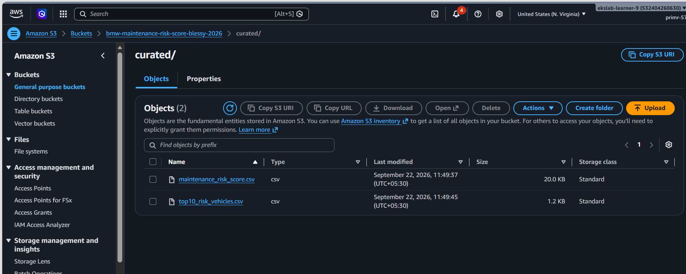
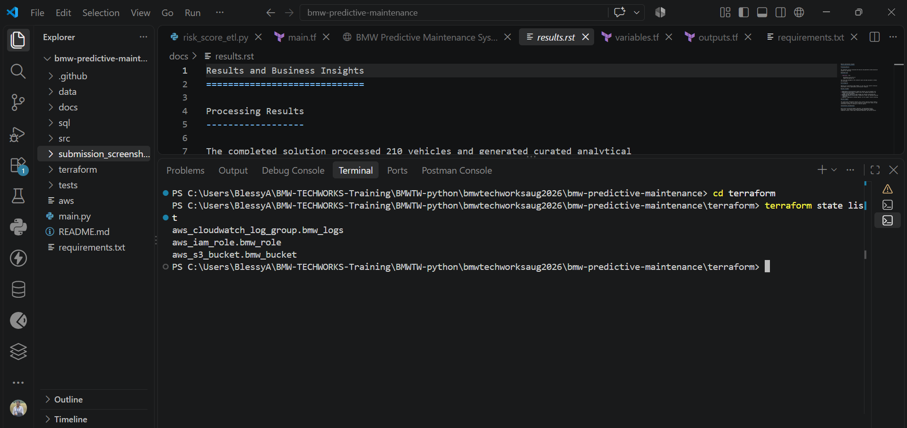

# BMW Predictive Maintenance System

## Project Overview

The BMW Predictive Maintenance System is an end-to-end data engineering and analytics solution designed to identify vehicles that are likely to require maintenance based on historical maintenance records, telemetry data, fault history, and vehicle information.

The project processes vehicle datasets using Python and PySpark, calculates maintenance risk scores, stores curated outputs in Amazon S3, performs analytics using Amazon Athena, and visualizes insights through Amazon QuickSight.

## Business Objective

The primary objective of this project is to:

- Predict vehicle maintenance risks.
- Identify high-risk vehicles requiring immediate attention.
- Analyze regional maintenance trends.
- Determine primary factors contributing to maintenance risks.
- Enable proactive and data-driven maintenance planning.

## Technology Stack

### Programming and Processing

- Python
- PySpark

### Infrastructure

- Terraform

### AWS Services

- Amazon S3
- AWS IAM
- Amazon CloudWatch
- Amazon Athena
- Amazon QuickSight

### Documentation

- Sphinx

## System Architecture

```text
Vehicle CSV Files
        |
        v
Python Data Validation
        |
        v
PySpark ETL Processing
        |
        v
Risk Score Calculation
        |
        v
Curated CSV Generation
        |
        v
Amazon S3
        |
        v
Amazon Athena
        |
        v
Amazon QuickSight Dashboard
```

## Project Components

### Data Validation Layer

The validation layer verifies:

- Missing values
- Invalid records
- Data quality issues
- Schema consistency

### ETL Processing Layer

PySpark is used to:

- Read source datasets
- Transform and cleanse data
- Join datasets
- Calculate maintenance risk scores
- Categorize vehicles based on risk

### Risk Categorization

Vehicles are classified into:

- High Risk
- Medium Risk
- Low Risk

### Output Generation

The following curated datasets are generated:

```text
maintenance_risk_score.csv
top10_risk_vehicles.csv
```

## AWS Infrastructure

Infrastructure has been provisioned using Terraform.

### S3 Bucket

```text
bmw-maintenance-risk-score-blessy-2026
```

### IAM Role

```text
bmw-maintenance-role
```

### CloudWatch Log Group

```text
/aws/bmw-maintenance
```

## Athena Analytics

### Database

```text
bmw_predictive_maintenance
```

### Table

```text
maintenance_risk_score
```

### Records Processed

```text
210
```

### Sample Query

```sql
SELECT COUNT(*)
FROM maintenance_risk_score;
```

## QuickSight Dashboard

### Dashboard Name

```text
BMW Predictive Maintenance Dashboard
```

### Dashboard Features

#### Total Vehicles Monitored

Displays the total number of vehicles processed.

#### Risk Category Distribution

Visualizes the distribution across:

- High Risk
- Medium Risk
- Low Risk

#### Top 10 High-Risk Vehicles

Identifies vehicles requiring immediate maintenance attention.

#### Average Risk Score by Region

Provides regional maintenance risk insights.

#### Primary Risk Factors Analysis

Shows the leading causes of maintenance risks:

- High Mileage
- Frequent Faults
- Frequent Maintenance
- Temperature Trend

### Dashboard Link

[Open the BMW Predictive Maintenance Dashboard](https://us-east-1.quicksight.aws.amazon.com/sn/account/tamizh-sk/accounts/532404260630/dashboards/65fb5bca-c7a3-45c5-a412-010a14f38b1c)

> Note: The dashboard is accessible only to users with access to the corresponding AWS QuickSight account and permissions.

## Project Results

### Key Findings

- Total vehicles analyzed: 210
- High mileage is the most significant maintenance risk factor.
- High-risk vehicles can be identified proactively.
- Regional patterns in maintenance risks can be analyzed.
- Business users can monitor fleet health through interactive dashboards.

### Business Benefits

- Reduced vehicle downtime
- Improved fleet monitoring
- Data-driven maintenance planning
- Better operational efficiency
- Proactive maintenance scheduling

## Documentation

Project documentation has been generated using Sphinx and includes:

- Introduction
- Architecture
- AWS Infrastructure
- ETL Pipeline
- Athena Analytics
- QuickSight Dashboard
- Results
- Conclusion

## CI/CD Pipeline

GitHub Actions has been implemented to automate project validation and documentation verification.

### Pipeline Activities

- Python code validation
- Project structure validation
- Terraform validation
- Terraform formatting checks
- Sphinx documentation build

### Workflow Trigger

The CI/CD pipeline automatically executes whenever code is pushed to the repository or when a pull request is created.

### Benefits

- Ensures code quality
- Validates infrastructure configuration
- Verifies project structure
- Builds Sphinx documentation automatically
- Reduces manual verification effort

## Repository Structure

```text
bmw-predictive-maintenance/
|
├── terraform/
├── data/
├── docs/
├── submission_screenshots/
├── src/
├── maintenance_risk_score.csv
├── top10_risk_vehicles.csv
└── README.md
```

## Project Outputs and Screenshots

The following screenshots provide evidence of the project's key outputs, analytics workflow, cloud resources, and documentation.

### QuickSight Dashboard

The Amazon QuickSight dashboard presents maintenance risk insights, including vehicle risk categories, regional risk scores, and the primary factors contributing to maintenance risk.


### Athena Record Count

This screenshot shows the Amazon Athena query result confirming the number of processed records.


### S3 Curated Files

This view shows the curated output files stored in the Amazon S3 bucket.



### Sphinx Documentation

This screenshot shows the generated Sphinx project documentation.


### Terraform Resources

This view shows the AWS resources provisioned using Terraform.



### Athena Data Preview

This screenshot shows a preview of the maintenance risk data queried through Amazon Athena.


## Conclusion

The BMW Predictive Maintenance System successfully demonstrates an end-to-end cloud-based analytics solution using AWS services. The system processes vehicle datasets, calculates maintenance risk scores, stores curated data in Amazon S3, performs analytics using Amazon Athena, and delivers actionable business insights through Amazon QuickSight dashboards.

This solution enables proactive maintenance planning and supports data-driven decision-making for vehicle fleet management.

## Author

Blessy Sam

BMW Predictive Maintenance System

2026