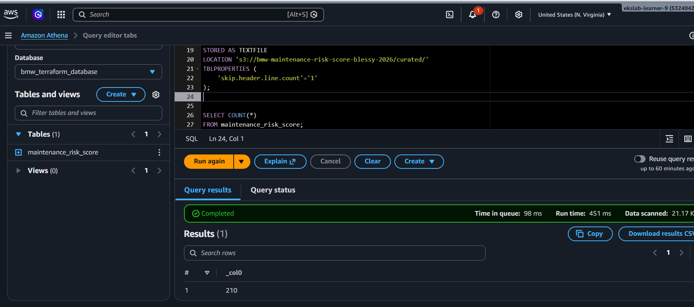
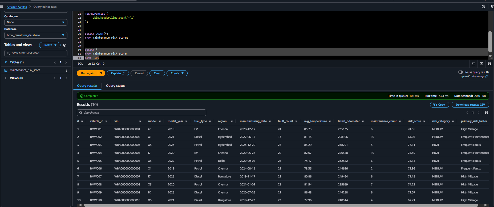

Athena Analytics
================

Athena queries the curated S3 files for risk reporting.

Database and Table
------------------

The project uses database ``bmw_predictive_maintenance`` and table
``maintenance_risk_score``.

Sample Query
------------

.. code-block:: sql

	SELECT COUNT(*)
	FROM bmw_predictive_maintenance.maintenance_risk_score;

The query confirms a record count of **210 vehicles** in the analytical table.

Record Count
------------

The Athena query results confirm that the curated dataset is available for
serverless analysis. The record-count output provides a quick validation of
the number of vehicles processed by the pipeline.

	Athena record-count result confirming 210 processed vehicles.

Data Preview
------------

A sample data preview makes it possible to inspect the analytical columns,
including vehicle identifiers, regions, risk scores, and risk categories,
before using the data in downstream reporting.

	Preview of maintenance risk records queried through Amazon Athena.

The preview verifies the fields used by the dashboard, including vehicle ID,
region, risk score, and risk category.
