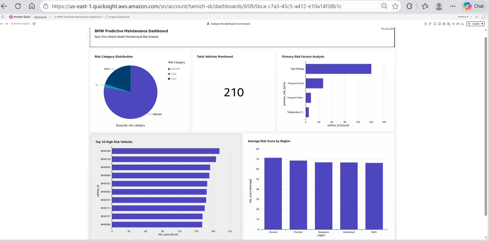

QuickSight Dashboard
====================

The BMW Predictive Maintenance Dashboard presents curated Athena data as an
operational view for maintenance teams.

Dashboard Name
--------------

.. code-block:: text

	BMW Predictive Maintenance Dashboard

Dashboard Screenshot
--------------------

	BMW Predictive Maintenance Dashboard showing the project's key risk
	monitoring and prioritization views.

Visuals and Business Value
--------------------------

* **Total Vehicles Monitored**
	* **Purpose:** Shows the size of the analytical fleet.
	* **Business value:** Establishes the reporting scope for maintenance teams.
* **Risk Category Distribution**
	* **Purpose:** Compares High, Medium, and Low risk vehicles.
	* **Business value:** Supports workload prioritization.
* **Top 10 High-Risk Vehicles**
	* **Purpose:** Lists vehicles with the highest risk scores.
	* **Business value:** Directs urgent service reviews.
* **Average Risk Score by Region**
	* **Purpose:** Compares risk across operating regions.
	* **Business value:** Supports regional resource planning.
* **Primary Risk Factors Analysis**
	* **Purpose:** Highlights mileage, faults, maintenance, and temperature
		trends.
	* **Business value:** Helps teams investigate likely causes of risk.

Filters
-------

* Risk category and region
* Vehicle identifier
* Risk-score and mileage ranges
