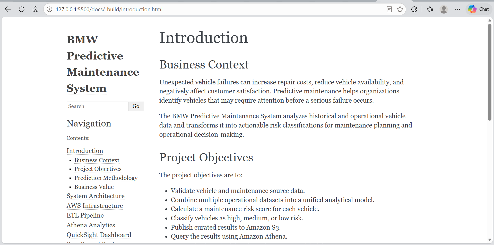

Results and Business Insights
=============================

Processing Results
------------------

* **Total vehicles processed:** 210
* **Curated outputs:** ``maintenance_risk_score.csv`` and
	``top10_risk_vehicles.csv``
* **Consumers:** Amazon Athena and Amazon QuickSight

Generated Files
---------------

.. code-block:: text

	 maintenance_risk_score.csv
	 top10_risk_vehicles.csv

The files were uploaded to the curated S3 layer for analysis and reporting.

	Sphinx documentation generated for the BMW Predictive Maintenance System.

Key Insights
------------

* **Risk distribution:** Vehicles are grouped into High, Medium, and Low risk
	for operational prioritization.
* **Top-risk vehicles:** The top-ten output identifies vehicles requiring
	immediate review.
* **Main risk factors:** High mileage, frequent faults, frequent maintenance,
	and temperature trends contribute to risk.
* **Regional insights:** Average risk by region supports resource planning and
	comparison of operating conditions.

Risk scores support maintenance decisions and should be reviewed alongside
inspection results and service history.
