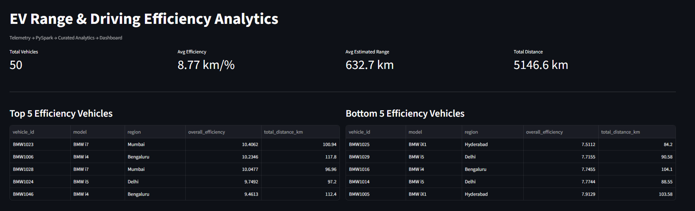
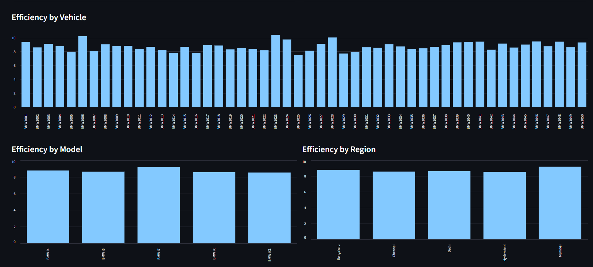

# 🚗 EV Range & Driving Efficiency Analytics

An end-to-end data engineering and analytics project for analyzing **EV driving efficiency, battery consumption, range trends, vehicle performance, model performance, and regional performance**.

The project demonstrates a complete data pipeline:

**CSV → Python Validation → Amazon S3 → PySpark/AWS Glue → Curated Parquet → Glue Data Catalog → Amazon Athena → FastAPI → Streamlit**

---

## 📌 Project Overview

The objective of this project is to analyze EV telemetry data and identify:

* Vehicle-level efficiency
* Model-level efficiency
* Region-level efficiency
* Battery consumption
* Estimated driving range
* Range trends over time
* Top 5 most efficient vehicles
* Bottom 5 least efficient vehicles

The generated dataset contains:

* **50 vehicles**
* **12 telemetry records per vehicle**
* **600 telemetry records in total**

---

# 🏗️ Architecture

The complete pipeline follows this architecture:

```text
                    EV TELEMETRY DATA
                           │
                           ▼
                  ┌─────────────────┐
                  │ Python Ingestion│
                  │ + Validation    │
                  └────────┬────────┘
                           │
                           ▼
                  ┌─────────────────┐
                  │   Amazon S3     │
                  │    RAW DATA     │
                  └────────┬────────┘
                           │
                           ▼
                  ┌─────────────────┐
                  │ AWS Glue /      │
                  │ PySpark         │
                  │ Transformation │
                  └────────┬────────┘
                           │
                           ▼
                  ┌─────────────────┐
                  │ Amazon S3       │
                  │ Curated Parquet │
                  └────────┬────────┘
                           │
                           ▼
                  ┌─────────────────┐
                  │ Glue Data       │
                  │ Catalog         │
                  └────────┬────────┘
                           │
                           ▼
                  ┌─────────────────┐
                  │ Amazon Athena   │
                  │ Analytics       │
                  └────────┬────────┘
                           │
                           ▼
                  ┌─────────────────┐
                  │ FastAPI         │
                  │ REST API        │
                  └────────┬────────┘
                           │
                           ▼
                  ┌─────────────────┐
                  │ Streamlit       │
                  │ Dashboard       │
                  └─────────────────┘
```

## 🖼️ Architecture Image

Place your architecture image in:

```text
doc/
└── architecture.png
```

Then use:

```md

```

> **Important:** Keep the image inside your Git repository. Using a relative path like `./doc/architecture.png` is more reliable than using a GitHub `blob` URL.

---

# 📊 Project Workflow

## 1. Data Generation

The project contains a generated EV telemetry dataset.

Example fields:

| Column            | Description                  |
| ----------------- | ---------------------------- |
| `vehicle_id`      | Unique vehicle identifier    |
| `model`           | EV model                     |
| `region`          | Vehicle operating region     |
| `timestamp`       | Telemetry timestamp          |
| `speed_kmh`       | Vehicle speed                |
| `battery_percent` | Remaining battery percentage |
| `distance_km`     | Distance travelled           |
| `temperature_c`   | Ambient temperature          |
| `charging`        | Charging status              |

---

# 🔍 Efficiency Calculation

Battery consumption is calculated using the previous telemetry record for each vehicle.

### Battery Consumption

```text
battery_consumed =
previous_battery_percent - current_battery_percent
```

Only positive battery consumption is used for efficiency calculations.

### Event Efficiency

```text
event_efficiency =
distance_km / battery_consumed
```

### Overall Vehicle Efficiency

```text
overall_efficiency =
total_distance_km / total_battery_consumed
```

The vehicle records are ordered by timestamp using a PySpark window function.

---

# ⚡ PySpark Processing

The PySpark pipeline demonstrates multiple Spark transformations and operations.

The pipeline performs:

* Data loading
* Data type conversion
* Null handling
* Filtering
* Selecting columns
* Window functions
* Battery consumption calculation
* Efficiency calculation
* `groupBy`
* Aggregations
* Ranking
* Parquet output

Example window operation:

```python
from pyspark.sql.window import Window
from pyspark.sql.functions import lag

window_spec = (
    Window
    .partitionBy("vehicle_id")
    .orderBy("timestamp")
)

df = df.withColumn(
    "previous_battery_percent",
    lag("battery_percent").over(window_spec)
)
```

---

# ☁️ AWS Architecture

The AWS implementation uses:

* Amazon S3
* AWS Glue
* AWS Glue Data Catalog
* Amazon Athena
* FastAPI
* Streamlit

### S3 Structure

```text
s3://j-project-team1/
│
├── raw/
│   └── vehicles/
│       └── dataset.csv
│
├── glue-scripts/
│   └── glue_job.py
│
├── curated/
│   ├── vehicle_efficiency/
│   ├── model_efficiency/
│   ├── region_efficiency/
│   └── range_trend/
│
└── athena-results/
```

---

# 🪣 Amazon S3

Raw telemetry data is stored in Amazon S3:

```text
s3://j-project-team1/raw/vehicles/dataset.csv
```

Example upload command:

```bash
aws s3 cp data/dataset.csv \
s3://j-project-team1/raw/vehicles/dataset.csv
```

Verify the upload:

```bash
aws s3 ls s3://j-project-team1/raw/vehicles/
```

---

# 🔥 AWS Glue

AWS Glue runs the PySpark transformation job.

The Glue job:

1. Reads raw CSV data from S3
2. Cleans the data
3. Applies window functions
4. Calculates battery consumption
5. Calculates efficiency
6. Aggregates vehicle/model/region metrics
7. Writes curated Parquet files back to S3

Glue script:

```text
glue/glue_job.py
```

Curated data is stored as Parquet:

```text
s3://j-project-team1/curated/
```

---

# 🗂️ Glue Data Catalog

AWS Glue Crawlers discover the curated Parquet datasets and create tables in the Glue Data Catalog.

Tables:

```text
vehicle_efficiency
model_efficiency
region_efficiency
range_trend
```

These tables provide metadata that allows Amazon Athena to query the Parquet data.

---

# 🔎 Amazon Athena

Athena is used as the analytical query layer.

Example:

```sql
SELECT
    vehicle_id,
    model,
    region,
    total_distance_km,
    overall_efficiency
FROM vehicle_efficiency
WHERE overall_efficiency IS NOT NULL
ORDER BY overall_efficiency DESC
LIMIT 5;
```

---

# 🏆 Top 5 Efficiency Vehicles

```sql
SELECT
    vehicle_id,
    model,
    region,
    total_distance_km,
    overall_efficiency
FROM vehicle_efficiency
WHERE overall_efficiency IS NOT NULL
ORDER BY overall_efficiency DESC
LIMIT 5;
```

---

# 📉 Bottom 5 Efficiency Vehicles

```sql
SELECT
    vehicle_id,
    model,
    region,
    total_distance_km,
    overall_efficiency
FROM vehicle_efficiency
WHERE overall_efficiency IS NOT NULL
ORDER BY overall_efficiency ASC
LIMIT 5;
```

---

# 🚘 Main Analytics

The project generates the following analytical datasets.

### Vehicle Efficiency

```text
vehicle_efficiency
```

Contains:

* Vehicle ID
* Model
* Region
* Total distance
* Total battery consumption
* Overall efficiency

### Model Efficiency

```text
model_efficiency
```

Contains aggregated efficiency metrics for each EV model.

### Region Efficiency

```text
region_efficiency
```

Contains aggregated efficiency metrics for each region.

### Range Trend

```text
range_trend
```

Contains estimated range information for visualization.

---

# 🚀 FastAPI

FastAPI provides the REST API layer between Athena and the dashboard.

Start the API:

```bash
uvicorn src.api.main:app --reload
```

## API Endpoints

### Health

```http
GET /health
```

### Summary

```http
GET /summary
```

### Top Vehicles

```http
GET /vehicles/top?limit=5
```

### Bottom Vehicles

```http
GET /vehicles/bottom?limit=5
```

### Models

```http
GET /models
```

### Regions

```http
GET /regions
```

### Range Trend

```http
GET /range-trend
```

---

# 📊 Streamlit Dashboard

The Streamlit application consumes the FastAPI endpoints and presents the analytics through an interactive dashboard.

Start the dashboard:

```bash
streamlit run src/dashboard/app.py
```

Dashboard includes:

* Total vehicles
* Average efficiency
* Average range
* Total distance
* Top efficient vehicles
* Bottom efficient vehicles
* Model efficiency
* Regional efficiency
* Range trend

---

# 🖼️ Dashboard / Final Output

Place your final dashboard screenshot here:

```text
doc/
└── proj_img1.png
```

Then add:

```md

```

### Final Dashboard


---

# 🖼️ Additional Screenshots

You can add additional screenshots like this:

### Athena Query

Place the image at:

```text
doc/
└── athena.png
```

```md

```

### AWS Glue

```text
doc/
└── glue.png
```

```md

```

### S3 Bucket

```text
doc/
└── s3.png
```

```md

```

### FastAPI

```text
doc/
└── fastapi.png
```

```md

```

---

# 📁 Project Structure

```text
ev-range-analytics/
│
├── README.md
├── requirements.txt
├── .gitignore
├── .env.example
│
├── data/
│   └── dataset.csv
│
├── doc/
│   ├── workflow.pdf
│   ├── proj_img1.png
│   ├── proj_img2.png
│
├── config/
│   └── aws_config.py
│
├── scripts/
│   └── run_local_pipeline.py
│
├── src/
│   ├── ingestion/
│   │   └── ingest.py
│   │
│   ├── validation/
│   │   └── validate.py
│   │
│   ├── pyspark/
│   │   ├── spark_session.py
│   │   ├── transform.py
│   │   ├── aggregations.py
│   │   └── ranking.py
│   │
│   ├── aws/
│   │   ├── s3.py
│   │   └── athena.py
│   │
│   ├── api/
│   │   ├── main.py
│   │   └── queries.py
│   │
│   └── dashboard/
│       └── app.py
│
├── glue/
│   └── glue_job.py
│
├── sql/
│   ├── vehicle_efficiency.sql
│   ├── model_efficiency.sql
│   ├── region_efficiency.sql
│   ├── top_bottom_vehicles.sql
│   └── range_trend.sql
│
└── tests/
    ├── test_validation.py
    └── test_transform.py
```

---

# 💻 Local Setup

## 1. Clone the repository

```bash
git clone <repository-url>
cd ev-range-analytics
```

## 2. Create virtual environment

### Windows

```powershell
python -m venv venv
.\venv\Scripts\Activate.ps1
```

### Linux/macOS

```bash
python3 -m venv .venv
source .venv/bin/activate
```

## 3. Install dependencies

```bash
pip install -r requirements.txt
```

---

# ▶️ Run Local Pipeline

Run the pipeline from the **project root**, not from the `scripts` directory.

```powershell
cd C:\project2
```

Set the Python path:

```powershell
$env:PYTHONPATH="."
```

Run:

```powershell
python scripts\run_local_pipeline.py
```

This avoids:

```text
ModuleNotFoundError: No module named 'src'
```

---

# 🔐 Environment Variables

Create a `.env` file:

```env
AWS_REGION=ap-south-1

S3_BUCKET_NAME=j-project-team1

S3_RAW_PREFIX=raw/vehicles/

S3_CURATED_PREFIX=curated/

S3_ATHENA_PREFIX=athena-results/

GLUE_DATABASE=ev_range_analytics

GLUE_CRAWLER=ev-range-crawler

ATHENA_WORKGROUP=primary

ATHENA_OUTPUT_LOCATION=s3://j-project-team1/athena-results/
```


Use:

```text
.env.example
```

for sharing configuration structure.

---

# 🧪 Testing

Run tests using:

```bash
pytest
```

Tests are located in:

```text
tests/
```

---

# 🛠️ Technologies Used

| Technology        | Purpose                                     |
| ----------------- | ------------------------------------------- |
| Python            | Ingestion, validation and application logic |
| PySpark           | Data transformation and analytics           |
| Amazon S3         | Data lake storage                           |
| AWS Glue          | Serverless ETL                              |
| Glue Data Catalog | Metadata management                         |
| Amazon Athena     | Analytical SQL queries                      |
| FastAPI           | REST API                                    |
| Streamlit         | Interactive dashboard                       |
| Parquet           | Curated analytical storage                  |
| Git/GitHub        | Version control                             |
| Terraform         | AWS infrastructure automation               |

---

# 🎯 Key Features

* End-to-end data engineering pipeline
* Python-based ingestion
* Data validation
* PySpark transformations
* Window functions
* Battery consumption calculation
* Vehicle efficiency calculation
* Model-level aggregation
* Region-level aggregation
* Ranking of vehicles
* Parquet-based analytical storage
* AWS Glue ETL
* Glue Data Catalog
* Athena SQL analytics
* FastAPI REST API
* Streamlit dashboard
* AWS cloud deployment

---

# 🔄 End-to-End Data Flow

```text
CSV
 │
 ▼
Python Validation
 │
 ▼
Amazon S3
 │
 ▼
AWS Glue / PySpark
 │
 ├── Vehicle Efficiency
 ├── Model Efficiency
 ├── Region Efficiency
 └── Range Trend
 │
 ▼
Parquet
 │
 ▼
Glue Data Catalog
 │
 ▼
Amazon Athena
 │
 ▼
FastAPI
 │
 ▼
Streamlit Dashboard
```

---

# 👥 Team

**Team 1**

Project:

**EV Range & Driving Efficiency Analytics**

---

#  Project Outcome

The project demonstrates how raw EV telemetry data can be transformed into an analytical data platform using modern cloud data engineering technologies.

The final system provides both:

* **Cloud-based analytical processing using AWS**
* **Interactive visualization through Streamlit**

allowing users to analyze EV efficiency at the **vehicle, model, regional, and time-series levels**.

---

# 📷 Project Screenshots

All project screenshots are stored in:

```text
doc/
```

Recommended structure:

```text
doc/
├── workflow.pdf
├── proj_img1.png
├── proj_imag2.png
```

Use relative Markdown paths:

```md




```
