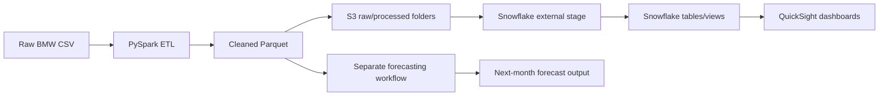

# BMW Sales Data Pipeline

This project builds a data pipeline for BMW sales analytics using Python, PySpark, AWS S3, Terraform, Snowflake, and QuickSight. The project is structured to keep the original ETL flow intact while adding a separate forecasting layer for next-month revenue prediction.

## Project objective

The goal of the project is to:

- ingest raw BMW sales data
- clean and validate the data using PySpark
- write the cleaned sales dataset to a Parquet file
- upload the raw and processed data to S3 in separate folders
- load the cleaned data into Snowflake using Terraform-managed infrastructure
- build QuickSight dashboards on Snowflake views
- generate a separate next-month revenue forecast without modifying the original ETL logic

## Architecture overview



## Repository structure

```text
capstonews/
├── README.md
├── README_SNOWFLAKE_QUICKSIGHT.md
├── pysparkws/
│   ├── pyproject.toml
│   ├── pysparkenv/
│   └── src/
│       └── pysparkmodule/
│           ├── data/
│           ├── forecasting/
│           ├── tests/
│           └── utils/
├── terraformbmw/
│   ├── basics/
│   ├── bootstrap/
│   ├── environments/
│   ├── modules/
│   └── snowflake/
└── docs/
    ├── requirements.txt
    ├── Makefile
    └── source/
```

## Key components

### 1. PySpark ETL
The ETL logic lives under:

- `pysparkws/src/pysparkmodule/utils/etl.py`

It is responsible for:

- reading the raw CSV
- validating required fields
- removing duplicates and invalid records
- converting columns to correct data types
- calculating revenue
- writing the cleaned Parquet output

### 2. Forecasting module
The separate ML forecasting workflow lives under:

- `pysparkws/src/pysparkmodule/forecasting/bmw_sales_forecasting.py`

It reads the cleaned Parquet file and produces:

- `bmw_monthly_sales_dataset.csv`
- `bmw_next_month_forecast.csv`

This is intentionally kept separate from the original ETL pipeline and does not overwrite historical ETL outputs.

### 3. Terraform infrastructure
The infrastructure code is under:

- `terraformbmw/basics/`
- `terraformbmw/snowflake/`

This includes:

- S3 bucket configuration
- object upload paths
- Snowflake storage integration
- external stage configuration
- IAM trust and permission setup

### 4. Snowflake + QuickSight analytics
The analytics layer uses Snowflake for warehouse processing and QuickSight for dashboards.

## Data flow and storage layout

The data is organized in logical folders such as:

```text
raw/bmw/
processed/bmw/
```

The cleaned dataset is stored as a Parquet file in:

```text
pysparkws/src/pysparkmodule/data/bmw_sales_cleaned.parquet
```

The forecasting outputs are stored in the same data directory, but as separate artifacts:

```text
pysparkws/src/pysparkmodule/data/bmw_monthly_sales_dataset.csv
pysparkws/src/pysparkmodule/data/bmw_next_month_forecast.csv
```

## Prerequisites

Before running the project, install the following:

- Python 3.10+
- Python virtual environment
- PySpark
- Pandas and PyArrow
- AWS CLI
- Terraform
- Snowflake account access
- QuickSight access with Snowflake connectivity

## Local setup

From the project root:

```powershell
cd "C:\Users\AnshulKedia\Documents\capstonews\pysparkws"
python -m venv .venv
.\.venv\Scripts\Activate.ps1
python -m pip install --upgrade pip
pip install pyspark python-dotenv pyarrow pandas pydotenv
pip install numpy scipy scikit-learn xgboost pytest
```

## Run the pipeline

### ETL pipeline

```powershell
cd "C:\Users\AnshulKedia\Documents\capstonews\pysparkws"
python src\pysparkmodule\utils\etl.py
```

This creates the cleaned Parquet file used by downstream systems.

### Forecasting pipeline

```powershell
cd "C:\Users\AnshulKedia\Documents\capstonews\pysparkws\src\pysparkmodule\forecasting"
C:\venvs\bmwforecast\Scripts\python.exe bmw_sales_forecasting.py
```

This produces the next-month revenue forecast without changing the ETL pipeline.

## Terraform usage

From the Terraform project folder:

```powershell
cd "C:\Users\AnshulKedia\Documents\capstonews\terraformbmw\snowflake"
terraform init
terraform validate
terraform plan
terraform apply
```

## Snowflake and QuickSight flow

1. Upload processed files to S3.
2. Configure Snowflake storage integration and stage.
3. Use `COPY INTO` to load data into warehouse tables.
4. Create views for business reporting.
5. Connect Snowflake to QuickSight.
6. Build dashboards using those views.

## Important project principles

- The ETL pipeline remains the canonical source of historical cleaned data.
- The forecasting workflow is separate and additive.
- Business dashboards should use Snowflake views rather than raw base tables.
- All infrastructure and pipeline changes should be validated before production use.

## Documentation

This repository includes:

- a general project README for setup and overview
- a dedicated Snowflake + QuickSight integration guide
- Sphinx documentation under `docs/source`

## Useful commands summary

| Task | Command | Purpose |
|---|---|---|
| Activate Python environment | `cd "C:\Users\AnshulKedia\Documents\capstonews\pysparkws"; .\.venv\Scripts\Activate.ps1` | Start the project environment |
| Run ETL | `python src\pysparkmodule\utils\etl.py` | Clean raw sales data and create a Parquet dataset |
| Run forecasting | `C:\venvs\bmwforecast\Scripts\python.exe src\pysparkmodule\forecasting\bmw_sales_forecasting.py` | Generate the monthly sales dataset and next-month forecast |
| Terraform init | `cd "C:\Users\AnshulKedia\Documents\capstonews\terraformbmw\snowflake"; terraform init` | Initialize Snowflake/S3 Terraform project |
| Terraform validate | `terraform validate` | Check Terraform configuration |
| Terraform apply | `terraform apply` | Provision or update infrastructure |
| Build docs | `cd "C:\Users\AnshulKedia\Documents\capstonews\pysparkws\docs"; python -m sphinx -b html source _build/html` | Build the Sphinx documentation |

## Notes

This project is intended to be a practical end-to-end sales analytics pipeline that combines raw data cleanup, cloud storage, warehouse loading, BI integration, and forecasting in a clean and maintainable structure.
