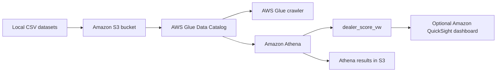

# Project Details and Architecture

## Purpose

BMW Dealer Scoreboard Performance is an AWS-based analytics project that combines dealer master data with sales, service, and customer feedback activity. It produces a comparable performance score and rank for each dealer for the 2025 calendar year.

The project keeps raw CSV data in Amazon S3, registers it in the AWS Glue Data Catalog, performs the scoring transformation in Amazon Athena, and exposes the resulting view as a source for optional Amazon QuickSight dashboards.

## Repository structure

```text
dealer_scoreboard_performance/
|-- datasets/
|   |-- dealer.csv
|   |-- sales.csv
|   |-- service.csv
|   `-- customer_feedback.csv
|-- sql/
|   `-- dealer_score_view.sql
|-- terraform/
|   |-- main.tf
|   |-- variables.tf
|   |-- outputs.tf
|   |-- provider.tf
|   |-- terraform.tfvars
|   `-- terraform.tfstate*
|-- README.md
`-- README_ARCHITECTURE.md
```

## Architecture



### Components

| Component | Responsibility |
|---|---|
| Local CSV files | Source data for dealers, sales, service activity, and feedback. |
| Amazon S3 | Stores source files under `datasets/<dataset>/` and Athena results under `athena-results/`. |
| AWS Glue database | Catalog database named `bmw_dealer_score_performace_db`. |
| AWS Glue table | `dealer` is managed explicitly by Terraform with a fixed schema. |
| AWS Glue crawler | Discovers and updates `sales`, `service`, and `customer_feedback` schemas. |
| Amazon Athena | Runs the scoring view and stores query results in the configured S3 prefix. |
| Amazon QuickSight | Optional visualization layer consuming the Athena view; it requires manual setup. |
| Terraform | Provisions the AWS resources and uploads the datasets. |

## Data model

### `dealer`

| Column | Type | Description |
|---|---|---|
| `dealer_id` | string | Dealer identifier and join key. |
| `dealer_name` | string | Display name of the dealer. |
| `region` | string | Dealer region. |
| `city` | string | Dealer city. |

### `sales`

Expected columns are `sale_id`, `dealer_id`, `sale_date`, `vehicle_model`, `quantity`, and `unit_price`. Revenue is calculated as `quantity * unit_price` and aggregated by dealer.

### `service`

Expected columns are `service_id`, `dealer_id`, `service_date`, `service_type`, and `service_count`. Service activity is aggregated by dealer.

### `customer_feedback`

Expected columns are `feedback_id`, `dealer_id`, `feedback_date`, `rating`, and `feedback_category`. Ratings are averaged by dealer.

## Scoring logic

The view in `sql/dealer_score_view.sql` performs the following steps:

1. Filters sales, service, and feedback records to dates from `2025-01-01` inclusive through `2026-01-01` exclusive.
2. Aggregates revenue, service count, and average rating by `dealer_id`.
3. Left joins those aggregates to the dealer master table so dealers without activity remain in the result.
4. Replaces missing metrics with zero.
5. Min-max normalizes each metric across all dealers.
6. Applies the configured weights:
   - Revenue: 50%
   - Service count: 30%
   - Average rating: 20%
7. Converts the weighted result to a 0-100 score.
8. Rounds the score to two decimal places and assigns a descending rank.

For a metric where every dealer has the same value, the view assigns that metric a normalized value of `1.0` to avoid division by zero.

Conceptually:

```text
normalized_metric = (metric - minimum_metric) / (maximum_metric - minimum_metric)
score = 100 * (
    0.50 * normalized_revenue
  + 0.30 * normalized_service_count
  + 0.20 * normalized_average_rating
)
```

## Output view

The view is:

```text
bmw_dealer_score_performace_db.dealer_score_vw
```

It returns:

- `dealer_id`
- `dealer_name`
- `region`
- `revenue`
- `service_count`
- `average_rating`
- `dealer_performance_score`
- `dealer_rank`

## Security and operations

- S3 public access is blocked.
- S3 server-side encryption uses SSE-S3.
- Glue receives an IAM role for S3, Glue Catalog, and Athena operations required by the crawler.
- Terraform applies default `Project`, `Environment`, and `ManagedBy` tags.
- The bucket is configured with `force_destroy = false` to reduce the risk of deleting stored data unintentionally.
- The SQL currently uses a fixed 2025 reporting period. Update the date predicates when introducing a new reporting year.
- The project name contains the existing spelling `performace`; resource and database names follow that value for consistency.

## Extension points

- Parameterize the reporting period in a generated query or separate views.
- Add data-quality checks for duplicate IDs, missing dealer IDs, invalid dates, and ratings outside the expected range.
- Add Terraform-managed QuickSight resources if dashboard deployment needs to be automated.
- Add partitioning or Parquet conversion if the datasets grow beyond the current CSV workload.
- Add CI validation for `terraform fmt`, `terraform validate`, and SQL execution in a test Athena environment.
