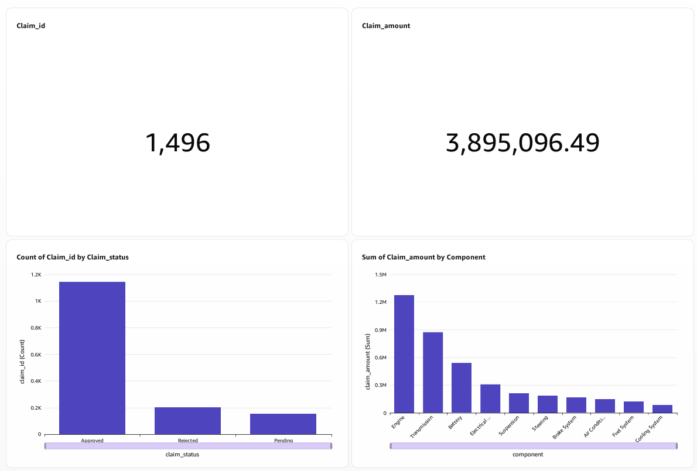
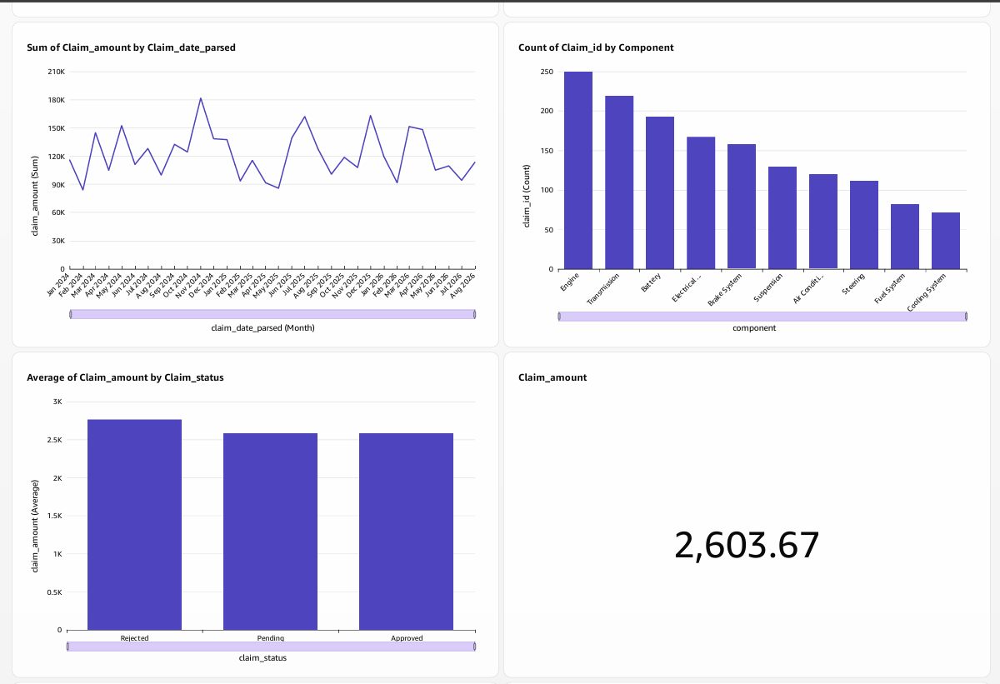
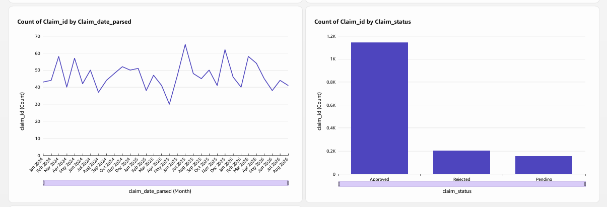

Amazon QuickSight
=================

Amazon QuickSight is used as the business intelligence and visualization
layer of the BMW Warranty Claims Analytics project.

Data Source
-----------

The QuickSight dashboard uses the validated warranty data from Amazon
Athena.

The primary dataset is:

::

    warranty_valid

The Athena database is:

::

    bmw_warranty_analytics

The processed data is stored in Amazon S3 in Parquet format.

SPICE
-----

The QuickSight dataset uses SPICE for dashboard performance.

SPICE provides an in-memory analytics layer so dashboard visuals can be
queried efficiently without executing every visualization directly
against the underlying source.

Dashboard
---------

The project dashboard is:

::

    BMW Warranty Claims Analytics Dashboard

Dashboard Visuals
-----------------

The dashboard contains the following analytical visuals.

Total Claims
~~~~~~~~~~~~

A KPI visual displaying the total number of validated warranty claims.

Current value:

::

    1,496

Total Claim Amount
~~~~~~~~~~~~~~~~~~

A KPI visual displaying the total warranty claim amount.

Current value:

::

    3,895,096.49

Claims by Status
~~~~~~~~~~~~~~~~

A visual showing the distribution of warranty claims across claim
statuses.

Total Claim Amount by Component
~~~~~~~~~~~~~~~~~~~~~~~~~~~~~~

A visual comparing total warranty claim costs across vehicle components.

Monthly Claim Amount Trend
~~~~~~~~~~~~~~~~~~~~~~~~~~

A time-series visual showing how total warranty claim amount changes
over time.

Claims by Component
~~~~~~~~~~~~~~~~~~~

A count-based visual showing the number of warranty claims for each
vehicle component.

Average Claim Amount by Claim Status
~~~~~~~~~~~~~~~~~~~~~~~~~~~~~~~~~~~~

A visual comparing the average warranty claim amount across different
claim statuses.

Average Claim Amount
~~~~~~~~~~~~~~~~~~~~

A KPI displaying the average claim amount.

Current value is approximately:

::

    2,603.67

Monthly Claim Count Trend
~~~~~~~~~~~~~~~~~~~~~~~~~

A time-series visual showing the number of warranty claims over time.

Dashboard Purpose
-----------------

The dashboard provides a consolidated view of warranty claim activity,
cost, status, component-level performance, and monthly trends.

It allows users to explore the processed warranty data through
interactive business intelligence visualizations.

Dashboard Screenshots
=====================

The following screenshots show the BMW Warranty Claims Analytics
dashboard developed using Amazon QuickSight.

Dashboard Overview
------------------

Dashboard Analytics
-------------------

Additional Dashboard Visuals
----------------------------

