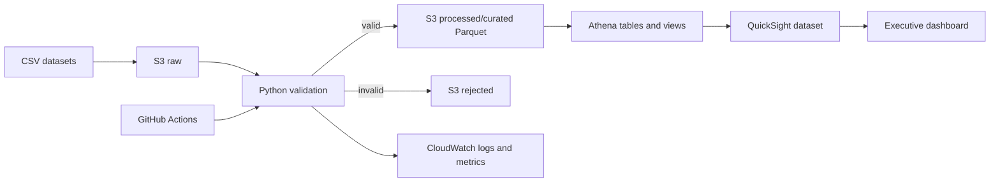

# BMW Executive Analytics Dashboard

Participant 14 capstone implementation for a governed executive analytics platform across sales, vehicles, telemetry, service, faults, and warranty.

## Architecture



## Repository map

- `src/`: ingestion, validation, transformation, analytics, configuration, logging
- `sql/`: Athena DDL, KPI queries, curated views
- `tests/`: unit tests for KPI calculations and validation rules
- `docs/`: PRD, data dictionary, AWS design, dashboard, operations, roadmap, presentation
- `terraform/`: S3 baseline with encryption, versioning, and public access blocks
- `.github/workflows/`: test, package, and main-branch deployment workflow

## Local setup

```powershell
python -m venv .venv
.\.venv\Scripts\Activate.ps1
pip install -r requirements.txt
python -m pytest -q
ruff check src tests
```

## Generate sample data

The reproducible generator uses `pandas` and `Faker` and writes six joinable CSV files to `data/`:

```powershell
python generate_data.py
```

Use `python generate_data.py --output-dir data --seed 20260917` to choose the output location and seed. The files contain realistic nulls and duplicate rows in non-key attributes for data-quality testing; identifier columns remain valid for Athena joins.

## AWS setup

1. Create a globally unique bucket name and configure AWS credentials through an IAM role or environment-based AWS credential provider.
2. `terraform init` and `terraform apply -var='bucket_name=<unique-name>'` from `terraform/`.
3. Upload datasets below `raw/{dataset}/`.
4. Run the validation/curation job and write valid records as Parquet under `curated/`.
5. Run `sql/001_create_database.sql` in Athena, then repair partitions or use partition projection.
6. Create the QuickSight Athena dataset using `sql/003_curated_views.sql` and configure RLS from `docs/dashboard_design.md`.

No credentials belong in this repository. Use an OIDC trust relationship from GitHub Actions to an AWS deployment role.

## KPI definitions

Revenue is `SUM(price * quantity)`. Sales is `SUM(quantity)`. Vehicles is `COUNT(DISTINCT vehicle_id)`. Average battery is `AVG(battery_level)`. Critical faults are telemetry records with a non-null `fault_code`. Warranty cost is `SUM(claim_amount)`. Service volume is `COUNT(DISTINCT service_id)`.

See `docs/` for the complete implementation plan, security model, testing strategy, monitoring, UAT, and presentation script.
